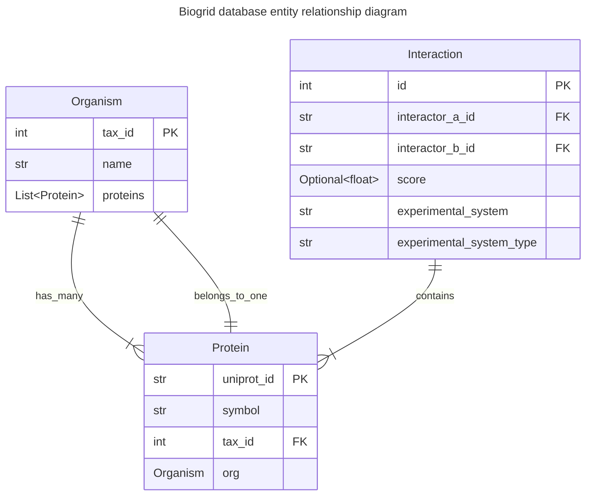

```mermaid
---
title: Biogrid database entity relationship diagram
---
erDiagram
    Organism ||--|{Protein: has_many
    Protein ||--||Organism: belongs_to_one
    Interaction ||--|{Protein: contains 


    Protein{
        str uniprot_id PK
        str symbol
        int tax_id FK
        Organism org
    }

    Organism{
        int tax_id PK
        str name
        List~Protein~ proteins
    }

    Interaction{
        int id PK
        str interactor_a_id FK
        str interactor_b_id FK
        Optional~float~ score
        str experimental_system
        str experimental_system_type
    }
```