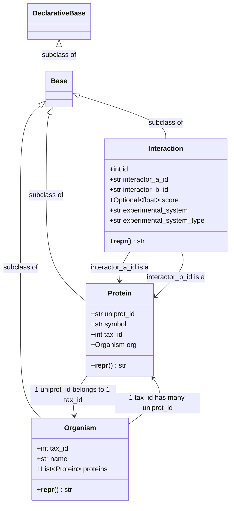

```mermaid
classDiagram

    class Base {
    }

    class Protein {
        +str uniprot_id
        +str symbol
        +int tax_id
        +Organism org
        +__repr__() str
    }

    class Organism {
        +int tax_id
        +str name
        +List~Protein~ proteins
        +__repr__() str
    }

    class Interaction {
        +int id
        +str interactor_a_id 
        +str interactor_b_id
        +Optional~float~ score
        +str experimental_system
        +str experimental_system_type
        +__repr__() str
    }
    DeclarativeBase <|-- Base : subclass of
    Base <|-- Protein : subclass of
    Base <|-- Organism : subclass of
    Base <|-- Interaction : subclass of
    Protein --> Organism : 1 uniprot_id belongs to 1 tax_id
    Organism --> Protein : 1 tax_id has many uniprot_id
    Interaction --> Protein : interactor_a_id is a
    Interaction --> Protein : interactor_b_id is a
```